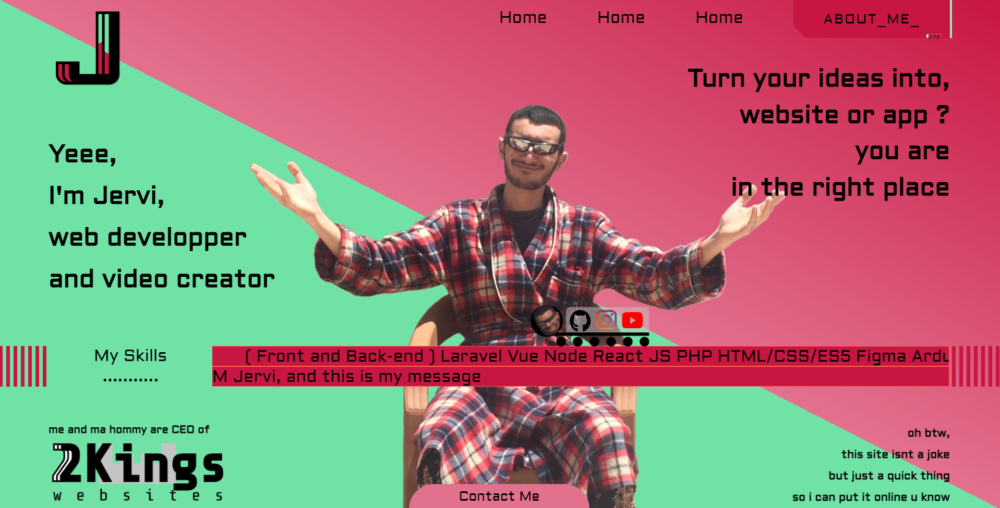

<h1 align="center">Jervi - portfolio</h1>

  <h3>
     | 
    <a href="https://jervi.netlify.app/">
      Demo
    </a>
     | 
  </h3>

### in process

    <ul>
        <li><input type="checkbox" >  Animate on load  </li>
        <li><input type="checkbox" >  about me modal  </li>
        <li><input type="checkbox" >  my skills modal  </li>
        <li><input type="checkbox" >  turn moto pic into gif  </li>
        <li><input type="checkbox" >  Responsive  </li>
        <li><input type="checkbox" >  make form mailing system 
            <ul>
                <li>kinda link it with a database</li>
                <li>make an admin template to check sent emails</li>
            </ul> 
        </li>
    </ul>
    <ul>
        <li><input type="checkbox" checked disabled>  Logo  </li>
        <li><input type="checkbox" checked disabled>  Jervi pic  </li>
        <li><input type="checkbox" checked disabled>  moto pic  </li>
        <li><input type="checkbox" checked disabled>  font modern  </li>
        <li><input type="checkbox" checked disabled>  sliding band (marquee)  </li>
        <li><input type="checkbox" checked disabled>  2KingsWebsites logo  </li>
        <li><input type="checkbox" checked disabled>  Contanct me modal  </li>
    </ul>

    

<link rel="stylesheet" href="https://cdnjs.cloudflare.com/ajax/libs/font-awesome/4.7.0/css/font-awesome.min.css">

## My Socials

[<i class="fa fa-instagram icon" ></i>](https://www.instagram.com/gacem_humen/)

[<i class="fa fa-youtube-play icon" ></i>](https://www.youtube.com/channel/UCD-YOxxLv5yGhcerkZLGZgg)

[<i class="fa fa-facebook-square icon" ></i>](https://www.youtube.com/channel/UCD-YOxxLv5yGhcerkZLGZgg)

